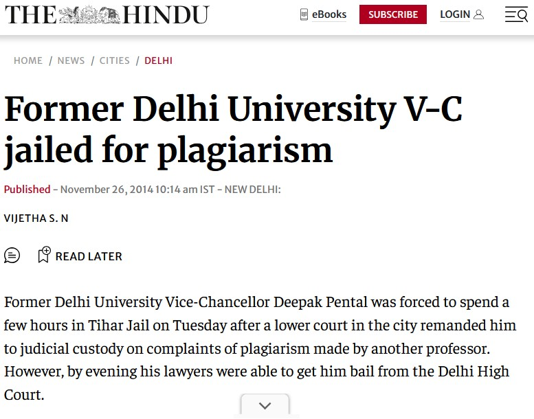
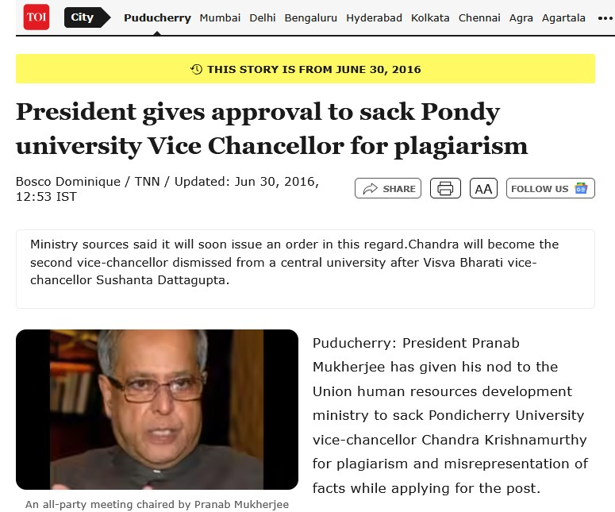
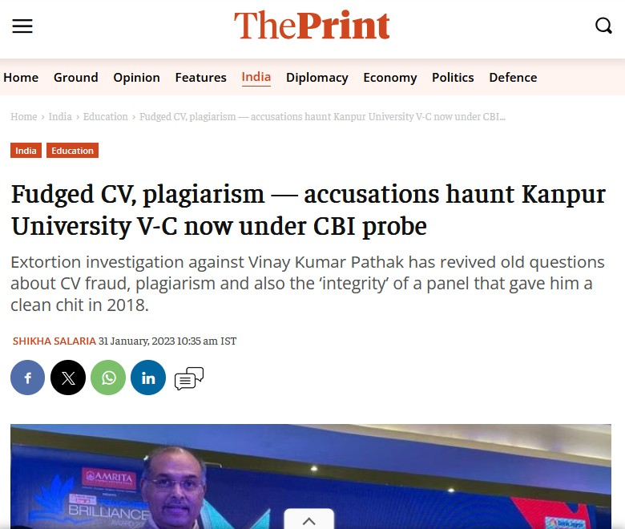
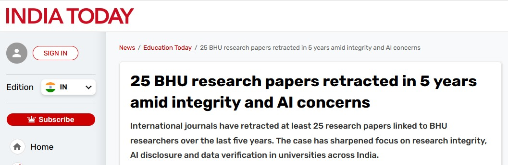
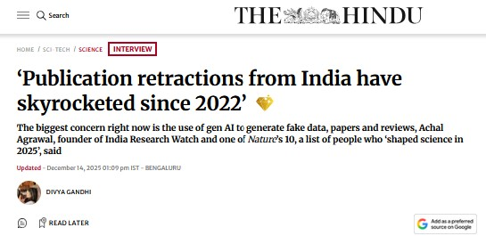
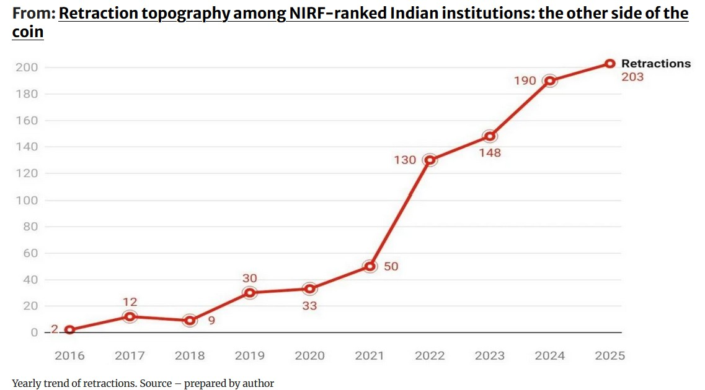

## Why this matters, before any definition {.smaller}

. . .

**One paper. 1998. *The Lancet*.** Andrew Wakefield linked the MMR vaccine to autism. The data were falsified and the conflicts of interest undisclosed.

. . .

Retracted in 2010. But the damage outlived the retraction: collapsing vaccine coverage and **measles outbreaks that continue 25+ years later.**

. . .

Closer to home, Indian Vice-Chancellors and senior faculty have been **removed from office** over plagiarism. The UGC wrote its 2018 law *because of* cases like these.

. . .

::: important
This is not only an ethics issue. It is a career, and a patient-safety, issue.
:::

::: notes
Time: ~3 min. Open on the consequence, not the definition. Land "this is about you."
Pose the hook and HOLD the answer for the toolkit segment:
"You copy your own methods paragraph from your last paper into this manuscript. Plagiarism, yes or no?" Take a show of hands. Don't answer yet.
:::

# This is not abstract {.inverse background-color="#1f5560"}

It reaches senior faculty, in India, now.

::: notes
Move fast through the next six clippings: "look, look, look." The point is proximity, not detail. Two minutes for the whole run.
:::

## A Vice-Chancellor sent to jail

{fig-align="center" width="52%"}

:::{.aside}
The Hindu, 26 November 2014. Former Delhi University V-C Deepak Pental.
:::

## A Vice-Chancellor sacked by the President

{fig-align="center" width="58%"}

:::{.aside}
The Times of India, 30 June 2016. Pondicherry University.
:::

## A Vice-Chancellor under CBI probe

{fig-align="center" width="56%"}

:::{.aside}
ThePrint, 31 January 2023. Kanpur University.
:::

## Twenty-five papers from one university, retracted

{fig-align="center" width="92%"}

:::{.aside}
India Today. Banaras Hindu University, retractions over integrity and AI concerns.
:::

## And it is accelerating

{fig-align="center" width="82%"}

:::{.aside}
The Hindu, 14 December 2025. Achal Agrawal, India Research Watch.
:::

## Retractions from Indian institutions, 2016 to 2025

{fig-align="center" width="78%"}

:::{.aside}
Retraction topography among NIRF-ranked Indian institutions. Yearly trend, source prepared by author.
:::

## What you'll be able to do {.smaller}

By the end of these 30 minutes:

::: incremental
1. **Recognise** the forms of plagiarism, including the ones that don't feel like plagiarism.
2. **Read** your similarity report against the **UGC 2018** thresholds and journal rules.
3. **Apply** real paraphrasing, quoting and citing techniques to your own thesis & manuscripts.
4. **Navigate** the grey zones: self-plagiarism, "common knowledge", methods text, and AI tools.
:::

::: notes
Time: ~30 sec. Read fast. The payload is the UGC table and the toolkit.
:::

## What plagiarism actually is

 

> Presenting someone else's **words or ideas** as your own, without attribution.

. . .

The half residents forget is **"or ideas."** You can plagiarise without copying a single sentence.

. . .

Two axes that cause all the confusion:

- **Intent:** deliberate · reckless · *unintentional.* &nbsp; [all three are penalised]{.important}
- **Object:** text · data · images · ideas / structure

. . .

::: {.callout-important appearance="simple"}
"I didn't mean to" is **not a defence** under the UGC regulations.
:::

::: notes
Time: ~3 min. Hammer the two points: ideas count, and intent does not excuse.
Plagiarism sits in the wider misconduct family: fabrication, falsification, plagiarism (FFP), plus image manipulation, paper mills, gift authorship. One line, don't dwell.
:::

## The taxonomy, from obvious to subtle {.smaller}

::: incremental
1. **Verbatim / copy-paste:** the obvious one.
2. **Mosaic / patchwork:** phrases stitched from several sources. *The most common resident error.*
3. **Close paraphrase:** change a few words, keep the structure. *Still plagiarism.*
4. **Idea / structure:** reuse an argument or framework, even fully reworded.
5. **Self-plagiarism & duplicate publication:** reusing your own text or data without disclosure ("salami slicing").
6. **Citation plagiarism:** citing a paper you never read, copied from another's reference list.
:::

::: notes
Time: ~2 min. Deliberate order: "everyone knows" then "wait, that counts?"
Tell them the next four slides are a game: plagiarism or acceptable?
:::

# Spot the plagiarism {.inverse background-color="#1f5560"}

Four real-world patterns. Reveal the verdict, then the fix.

::: notes
This is the core activity (~7 min total across the four).
For each: let them call it out FIRST, then reveal diagnosis, then the fix.
Run it in pairs if time allows, far stickier than a definition slide.
:::

## Example 1: Verbatim {.smaller}

::: {.callout-note appearance="simple"}
### Source (published, 2019)
"Anaemia in pregnancy remains a major public health challenge in India, contributing substantially to maternal morbidity and adverse perinatal outcomes."
:::

::: {.callout-warning appearance="simple"}
### In the resident's manuscript
Anaemia in pregnancy remains a major public health challenge in India, contributing substantially to maternal morbidity and adverse perinatal outcomes.
:::

. . .

::: important
**Verdict: Plagiarism.** Word-for-word, no quotation marks, no citation. The similarity checker flags 100% of this sentence.
:::

. . .

::: {.callout-tip appearance="simple"}
### Fix: paraphrase and cite
In India, anaemia during pregnancy is a leading contributor to maternal illness and poor newborn outcomes.[12]
:::

::: notes
The easy one; builds confidence. Note: even *with* a citation, copying verbatim without quote marks is still plagiarism.
:::

## Example 2: Mosaic / patchwork {.smaller}

::: {.callout-note appearance="simple"}
### Two sources
**A:** "…iron deficiency accounts for nearly half of all anaemia cases among pregnant women in low-income settings."

**B:** "…weekly iron–folic acid supplementation has been shown to reduce the prevalence of moderate anaemia."
:::

::: {.callout-warning appearance="simple"}
### In the manuscript (one sentence, no marks)
Iron deficiency accounts for nearly half of all anaemia cases among pregnant women, and weekly iron–folic acid supplementation has been shown to reduce the prevalence of moderate anaemia.
:::

. . .

::: important
**Verdict: Plagiarism.** Distinctive phrases lifted verbatim from two sources and stitched together. Adding the two citations does **not** fix it; the *wording* is still copied.
:::

. . .

::: {.callout-tip appearance="simple"}
### Fix: synthesise in your own words and cite both
Roughly half of anaemia in pregnant women is attributable to iron deficiency,[5] and weekly iron–folic acid dosing can lower moderate-anaemia rates.[8]
:::

::: notes
The trap most residents fall into when "combining references." Key teaching point: a citation is not permission to copy exact wording.
:::

## Example 3: Close paraphrase {.smaller}

::: {.callout-note appearance="simple"}
### Source
"Delayed initiation of antenatal care is strongly associated with poor pregnancy outcomes, particularly among women in rural and tribal communities."
:::

::: {.callout-warning appearance="simple"}
### In the manuscript (cited!)
Late starting of antenatal care is highly linked with bad pregnancy results, especially among women in rural and tribal populations.[9]
:::

. . .

::: important
**Verdict: Plagiarism.** Same sentence skeleton, synonyms swapped in slots. A citation does not rescue it. This is the classic "synonym-swap" failure, and modern checkers catch the structure.
:::

. . .

::: {.callout-tip appearance="simple"}
### Fix: rewrite from understanding
Women who book antenatal care late tend to have worse outcomes, and this gap is widest in rural and tribal areas.[9] &nbsp;*(Read it, look away, write it, then cite.)*
:::

::: notes
The most important slide for thesis writers. Demonstrate the "read, hide, rewrite" method live if you can. Synonym-swapping is not paraphrasing.
:::

## Example 4: Self-plagiarism {.smaller}

::: {.callout-note appearance="simple"}
### Your OWN earlier paper (2023)
"We conducted a community-based cross-sectional survey across 12 sub-centres using a two-stage cluster sampling design; households were selected by probability proportional to size."
:::

::: {.callout-warning appearance="simple"}
### Pasted into the new manuscript, unchanged, no note
We conducted a community-based cross-sectional survey across 12 sub-centres using a two-stage cluster sampling design; households were selected by probability proportional to size.
:::

. . .

::: important
**Verdict: Self-plagiarism.** Reusing your *own* published text without disclosure. The checker matches it against your prior paper, and editors treat it as a red flag.
:::

. . .

::: {.callout-tip appearance="simple"}
### Fix: rewrite and signpost the prior work
The sampling and survey procedures followed those of our earlier study.[3] Briefly, households across 12 sub-centres were enrolled using two-stage cluster sampling with probability proportional to size.
:::

::: notes
**This resolves the opening hook.** Answer it now out loud: yes, silently reusing your own methods paragraph is self-plagiarism. The fix: rewrite, cite your prior work, disclose. Single most common SR/JR trap.
:::

## The Indian rulebook: UGC 2018 {.smaller}

**UGC (Promotion of Academic Integrity & Prevention of Plagiarism in HEIs) Regulations, 2018** set out a *graded* penalty system based on your similarity index:

| Level | Similarity | Consequence (student / researcher; illustrative) |
|:--|:--|:--|
| **0** | ≤ 10% | Minor, **no penalty** |
| **1** | > 10–40% | Revise & resubmit (usually within 6 months) |
| **2** | > 40–60% | Debarred from resubmission for ~1 year |
| **3** | > 60% | Registration / programme can be **cancelled** |

. . .

::: {.callout-note appearance="simple"}
Your **thesis submission** requires a similarity report (Turnitin / DrillBit–ShodhShuddhi). Journals run a **second, independent** check at submission (iThenticate / Crossref Similarity Check).
:::

::: notes
Time: ~5 min, highest direct relevance to their thesis. For faculty the penalties escalate to loss of increments, supervision bans, suspension. Keep the table on screen while you bust the three myths next.
:::

## Three myths that get residents into trouble {.smaller}

::: incremental
- **Myth: "Under 10% means I'm safe."**
  9% lifted verbatim from *one* source is still plagiarism. The index is a **screen, not an absolution.**

- **Myth: "My references and quotes count against me."**
  A properly configured report **excludes** the bibliography and correctly quoted matter. Learn to read, and to set up, the report.

- **Myth: "My guide is responsible, not me."**
  The UGC penalises the **author.** Supervisors carry *separate, additional* liability; it does not transfer off you.
:::

::: notes
Time: part of the UGC segment. These three myths cause more grief than ignorance of the rules does.
:::

## The toolkit: how to NOT plagiarise {.smaller}

::: incremental
- **Paraphrase by understanding:** read, look away, write, then cite. Never synonym-swap with the source open.
- **Quote sparingly:** only for distinctive wording, definitions, contested claims, with quotation marks **and** citation.
- **Cite ideas, not just words:** every borrowed *claim* gets a citation, even when fully reworded.
- **"Common-knowledge" test:** would any expert state this without a source? If unsure, **cite.**
- **Methods grey zone:** rewrite, cite your prior work, disclose: *"as previously described [ref]."*
- **Workflow hygiene:** reference manager (Zotero) from day one; tag verbatim notes instantly; run *your own* similarity check **before** you submit.
:::

::: notes
Time: ~4 min (the Spot-the-Plagiarism examples already carried much of this). The "read, hide, rewrite" rule is the single most valuable habit to leave them with.
:::

## The AI frontier, 2026 {.smaller}

. . .

LLMs (ChatGPT and others) now both **write** and **get caught in** manuscripts. Journals flag tell-tale phrasing and fabricated references.

. . .

**Where policy stands (and it's moving):**

- UGC has **not** issued definitive guidance yet.
- AICTE restricts **unacknowledged** AI use.
- Most institutions & journals now treat **undisclosed AI-generated text as misconduct.**
- ICMJE / COPE: **disclose** AI use; AI **cannot** be an author.

. . .

::: important
AI may *assist* (grammar, structure) with disclosure. It must never generate claims, data, or citations you haven't verified.
:::

::: notes
Time: ~3 min. AI-fabricated references are a fast route to a misconduct finding; they look real and cite nothing real. If compressing to 20 min, this becomes a single slide.
:::

# Three rules to leave with {.inverse background-color="#1f5560"}

::: r-fit-text
Attribute everything borrowed.

Verify every reference.

Disclose every tool.
:::

::: notes
Time: ~2 min plus Q&A buffer. Connect back: paraphrasing & citation discipline also live in the IMRAD Methods and Results sessions of this workshop.
:::

## Thank you · Questions {.smaller}

**Quick references for your desk:**

- UGC Regulations 2018, your institutional plagiarism policy & similarity-report SOP
- COPE flowcharts, what editors do when misconduct is suspected
- ICMJE Recommendations, authorship & AI-disclosure criteria

. . .

::: important
Run your own similarity check before submission, not after rejection.
:::

::: notes
Leave the three rules slide up during Q&A if you can dual-display.
:::

# Questions?

# Thank You!
